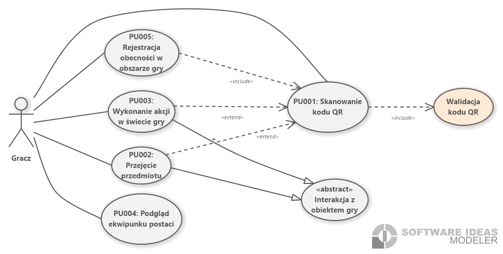
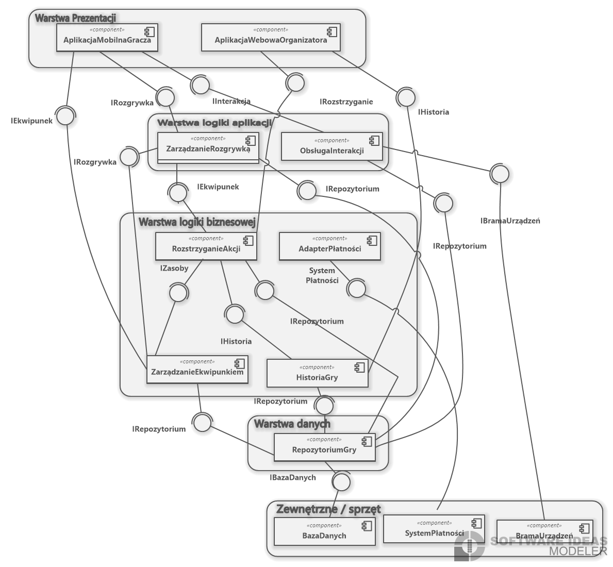
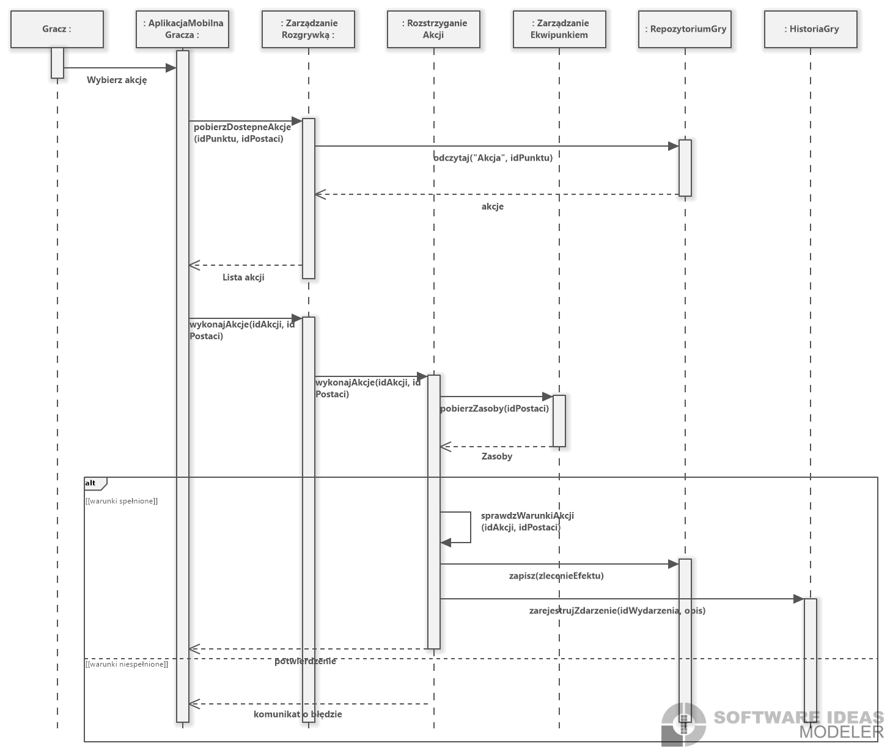
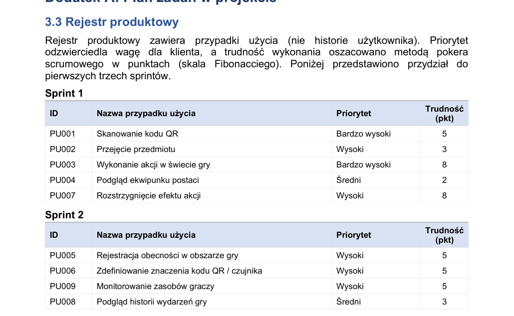

# LARPHub - Software Engineering Design Project

LARPHub is a software engineering design project for a system supporting chamber LARP events. The project focuses on requirements analysis, UML modeling, system architecture, sprint planning and Java code generation from a UML model.

> This is a **system design and documentation project**, not a production-ready application. Its purpose is to demonstrate how I approach requirements, architecture, use cases, domain modeling and Agile planning.

## Project overview

The system supports two main user groups:

- **Player** - uses a mobile app to interact with the game world, scan QR codes, collect items and check character inventory.
- **Organizer / Game Master** - uses a web application to define QR/censor meaning, resolve action effects, monitor player resources and review event history.

The project deliberately focuses on the most technically relevant gameplay core instead of generic functionality such as login or registration.

## What this project demonstrates

- Requirements analysis and use case modeling
- UML diagrams: use case, activity, class, component and sequence diagrams
- Domain modeling with class relationships, enumerations, aggregation and composition
- Layered system architecture design
- Product backlog and sprint planning
- Scrum-based estimation using Fibonacci story points
- Java interface/class skeleton generation from UML using a CASE tool

## Tools and methods

- UML
- RSL-bis use case scenarios
- Software Ideas Modeler
- Scrum backlog planning
- Java code generation from UML

## Repository structure

```text
larphub-software-engineering-design/
├── README.md
├── LICENSE
├── agile/
│   ├── product-backlog.md
│   └── sprint-1-backlog.md
├── diagrams/
│   ├── use-case-player-interaction.png
│   ├── use-case-organizer-flow.png
│   ├── activity-pu003.png
│   ├── domain-class-model.png
│   ├── component-architecture.png
│   ├── sequence-pu003.png
│   ├── interface-realization.png
│   └── product-backlog-sprints.png
├── docs/
│   └── LARPHub_Project_Documentation.pdf
├── requirements/
│   ├── use-cases.md
│   └── rsl-bis-scenarios.md
└── src/
    └── generated-java/
        ├── IRozstrzyganie.java
        └── RozstrzyganieAkcjiService.java
```

## Key diagrams

### Use case model - player interaction



### Component architecture



### Sequence diagram - executing an action in the game world



### Product backlog and sprint planning



## Functional scope

### Player area

- Scan QR code
- Collect item
- Execute an action in the game world
- View character inventory
- Register presence in the game area

### Organizer area

- Define QR code / sensor meaning
- Resolve action effects
- View game event history
- Monitor player resources

## Architecture approach

The system was designed using a layered architecture:

1. **Presentation layer** - mobile application for players and web application for organizers.
2. **Application logic layer** - orchestration of gameplay and user interactions.
3. **Business logic layer** - action resolution, inventory management and event history.
4. **Data layer** - game repository responsible for storing and retrieving system data.
5. **Device gateway** - interaction with physical QR codes and sensors.

This separation makes the system easier to understand, maintain and extend.

## Agile approach

The project includes a product backlog divided into three sprints. The first sprint focuses on delivering the core gameplay loop:

```text
scan QR code -> collect item / execute action -> resolve effect -> view inventory
```

Backlog items were prioritized based on user value and estimated using Fibonacci story points.

## Generated Java skeleton

The project includes an example Java interface and service class generated from the UML model. This shows how the design model can be translated into implementation-level artifacts.

## Full documentation

The complete project documentation is available here:

[docs/LARPHub_Project_Documentation.pdf](docs/LARPHub_Project_Documentation.pdf)

## What I learned

- How to translate business/game requirements into structured use cases
- How to model system behavior using UML activity and sequence diagrams
- How to design a layered system architecture
- How to prepare a product backlog and sprint backlog
- How to connect software design artifacts with generated code skeletons

